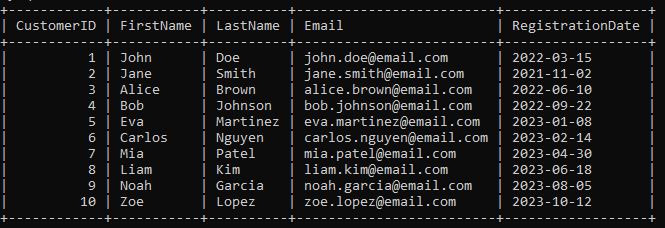
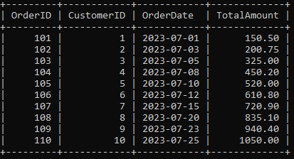
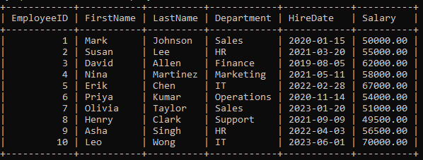

# 🗄️ Data_Transformer

> A comprehensive SQL project demonstrating real-world **data transformation** techniques using MySQL — covering joins, subqueries, window functions, string operations, date manipulation, conditional logic, and analytical queries.

<br>


---

## 📋 Table of Contents

- [📖 Project Overview](#-project-overview)
- [📁 Repository Structure](#-repository-structure)
- [🗃️ Database Schema](#️-database-schema)
  - [👥 Customers Table](#-customers-table)
  - [🛒 Orders Table](#-orders-table)
  - [🧑‍💼 Employees Table](#️-employees-table)
- [📊 Sample Data Overview](#-sample-data-overview)
- [⚙️ SQL Operations Covered](#️-sql-operations-covered)
  - [🔗 JOIN Operations](#-join-operations)
  - [🔍 Subqueries](#-subqueries)
  - [📅 Date Functions](#-date-functions)
  - [🔤 String Functions](#-string-functions)
  - [🪟 Window Functions](#-window-functions)
  - [🔀 CASE Expressions](#-case-expressions)
- [🚀 Getting Started](#-getting-started)
- [💡 Query Reference Table](#-query-reference-table)
- [🧠 Key Learnings](#-key-learnings)
- [🛠️ Tools & Technologies](#️-tools--technologies)
- [🤝 Contributing](#-contributing)
- [👤 Author](#-author)
- [📄 License](#-license)

---

## 📖 Project Overview

**Data_Transformer** is a hands-on SQL project built to explore and practice the most essential data transformation operations used in real-world data analysis and backend development. Using a simple but realistic business scenario — customers, orders, and employees — this project walks through a wide variety of SQL techniques that transform raw relational data into meaningful, readable insights.

Whether you're a beginner learning SQL fundamentals or an intermediate developer brushing up on advanced functions, this project serves as a solid reference point for:

- Understanding how relational databases work through **primary and foreign key relationships**
- Writing efficient **JOIN** queries to combine data across multiple tables
- Using **subqueries** to filter data based on aggregated conditions
- Applying **window functions** for running totals and rankings without collapsing rows
- Manipulating **dates and strings** to clean and format data for reporting
- Implementing **conditional logic** with `CASE` to categorize records by business rules

The database is called `DataTransformer` and contains three core tables: `Customers`, `Orders`, and `Employees`, each populated with 10 sample records that simulate a small business environment.

This project is ideal for:
- 🎓 **Students** learning SQL for the first time
- 💼 **Data Analysts** looking for a practical SQL reference
- 🧑‍💻 **Backend Developers** who need to write transformation queries
- 📚 **Anyone** preparing for SQL-based technical interviews

---

## 📁 Repository Structure

```
Data_Transformer/
│
├── 📄 Data_Transformer.sql       # Main SQL file — table creation, data insertion & all queries
│
├── 📂 Tables/                    # Folder containing table screenshots from MySQL Workbench
│   ├── 🖼️ Customer_Table.PNG     # Screenshot of the Customers table output
│   ├── 🖼️ Employe_Table.PNG      # Screenshot of the Employees table output
│   └── 🖼️ Order_Table.PNG        # Screenshot of the Orders table output
│
├── 📘 README.md                  # Project documentation (you are here!)
└── 📜 LICENSE.txt                # MIT License
```

**File Descriptions:**

- `Data_Transformer.sql` — The heart of the project. Contains all `CREATE TABLE`, `INSERT INTO`, and `SELECT` statements. Queries are numbered and commented for easy navigation.
- `Tables/` — A folder containing PNG screenshots of the actual MySQL table outputs. Useful for quick visual reference without running the SQL.
- `README.md` — Full project documentation including schema details, query explanations, setup instructions, and learning outcomes.
- `LICENSE.txt` — MIT License granting open use, modification, and distribution rights.

---

## 🗃️ Database Schema

The database `DataTransformer` consists of three tables with the following entity relationships:

```
┌─────────────────────┐          ┌─────────────────────┐
│     Customers        │          │       Orders         │
│─────────────────────│          │─────────────────────│
│ CustomerID (PK) ────┼──────────┤ CustomerID (FK)      │
│ FirstName            │  1 : N   │ OrderID (PK)         │
│ LastName             │          │ OrderDate            │
│ Email                │          │ TotalAmount          │
│ RegistrationDate     │          └─────────────────────┘
└─────────────────────┘

┌─────────────────────┐
│     Employees        │
│─────────────────────│
│ EmployeeID (PK)      │   (Standalone — no FK relationship)
│ FirstName            │
│ LastName             │
│ Department           │
│ HireDate             │
│ Salary               │
└─────────────────────┘
```

One customer can have many orders (1:N relationship). The Employees table is independent and represents internal HR data.

---

### 👥 Customers Table

Stores core customer information along with the date they registered on the platform.



```sql
CREATE TABLE Customers (
    CustomerID INT PRIMARY KEY AUTO_INCREMENT,
    FirstName VARCHAR(50) NOT NULL,
    LastName VARCHAR(50) NOT NULL,
    Email VARCHAR(100) NOT NULL,
    RegistrationDate DATE NOT NULL
);
```

| Column | Data Type | Constraint | Description |
|---|---|---|---|
| CustomerID | INT | PRIMARY KEY, AUTO_INCREMENT | Unique identifier for each customer |
| FirstName | VARCHAR(50) | NOT NULL | Customer's first name |
| LastName | VARCHAR(50) | NOT NULL | Customer's last name |
| Email | VARCHAR(100) | NOT NULL | Customer's email address |
| RegistrationDate | DATE | NOT NULL | Date the customer registered on the platform |

**Design Notes:**
- `AUTO_INCREMENT` ensures no two customers share the same ID, even after deletions.
- `VARCHAR(100)` for Email gives enough room for most real-world email formats.
- `RegistrationDate` allows time-based analysis such as cohort analysis or churn tracking.

---

### 🛒 Orders Table

Tracks all orders placed by customers, linked via a foreign key to the Customers table.



```sql
CREATE TABLE Orders (
    OrderID INT PRIMARY KEY AUTO_INCREMENT,
    CustomerID INT NOT NULL,
    OrderDate DATE NOT NULL,
    TotalAmount DECIMAL(10,2) NOT NULL,
    FOREIGN KEY (CustomerID) REFERENCES Customers(CustomerID)
);
```

| Column | Data Type | Constraint | Description |
|---|---|---|---|
| OrderID | INT | PRIMARY KEY, AUTO_INCREMENT | Unique identifier for each order |
| CustomerID | INT | FOREIGN KEY → Customers | Links each order to a specific customer |
| OrderDate | DATE | NOT NULL | The date the order was placed |
| TotalAmount | DECIMAL(10,2) | NOT NULL | The total monetary value of the order in dollars |

**Design Notes:**
- `FOREIGN KEY (CustomerID) REFERENCES Customers(CustomerID)` enforces **referential integrity** — you cannot insert an order for a customer that doesn't exist.
- `DECIMAL(10,2)` is used for monetary values instead of `FLOAT` to avoid floating-point precision errors in financial calculations.

---

### 🧑‍💼 Employees Table

Contains employee records spanning multiple departments with salary and hire date information.



```sql
CREATE TABLE Employees (
    EmployeeID INT PRIMARY KEY AUTO_INCREMENT,
    FirstName VARCHAR(50) NOT NULL,
    LastName VARCHAR(50) NOT NULL,
    Department VARCHAR(50) NOT NULL,
    HireDate DATE NOT NULL,
    Salary DECIMAL(10,2) NOT NULL
);
```

| Column | Data Type | Constraint | Description |
|---|---|---|---|
| EmployeeID | INT | PRIMARY KEY, AUTO_INCREMENT | Unique identifier for each employee |
| FirstName | VARCHAR(50) | NOT NULL | Employee's first name |
| LastName | VARCHAR(50) | NOT NULL | Employee's last name |
| Department | VARCHAR(50) | NOT NULL | The department the employee works in |
| HireDate | DATE | NOT NULL | The date the employee was officially hired |
| Salary | DECIMAL(10,2) | NOT NULL | Employee's annual salary in dollars |

**Design Notes:**
- `HireDate` enables seniority calculations and tenure-based filtering.
- `DECIMAL(10,2)` is used for `Salary` to ensure accurate financial reporting — never use `FLOAT` for money.
- Departments span: Sales, HR, Finance, Marketing, IT, Operations, and Support.

---

## 📊 Sample Data Overview

### 👥 Customers — 10 Records

| CustomerID | Name | Email | Registered |
|---|---|---|---|
| 1 | John Doe | john.doe@email.com | 2022-03-15 |
| 2 | Jane Smith | jane.smith@email.com | 2021-11-02 |
| 3 | Alice Brown | alice.brown@email.com | 2022-06-10 |
| 4 | Bob Johnson | bob.johnson@email.com | 2022-09-22 |
| 5 | Eva Martinez | eva.martinez@email.com | 2023-01-08 |
| 6 | Carlos Nguyen | carlos.nguyen@email.com | 2023-02-14 |
| 7 | Mia Patel | mia.patel@email.com | 2023-04-30 |
| 8 | Liam Kim | liam.kim@email.com | 2023-06-18 |
| 9 | Noah Garcia | noah.garcia@email.com | 2023-08-05 |
| 10 | Zoe Lopez | zoe.lopez@email.com | 2023-10-12 |

> 📌 Registration dates span from **November 2021** to **October 2023**, representing a growing customer base over ~2 years.

---

### 🛒 Orders — 10 Records

| OrderID | CustomerID | Order Date | Total Amount |
|---|---|---|---|
| 101 | 1 | 2023-07-01 | $150.50 |
| 102 | 2 | 2023-07-03 | $200.75 |
| 103 | 3 | 2023-07-05 | $325.00 |
| 104 | 4 | 2023-07-08 | $450.20 |
| 105 | 5 | 2023-07-10 | $520.00 |
| 106 | 6 | 2023-07-12 | $610.80 |
| 107 | 7 | 2023-07-15 | $720.90 |
| 108 | 8 | 2023-07-20 | $835.10 |
| 109 | 9 | 2023-07-23 | $940.40 |
| 110 | 10 | 2023-07-25 | $1,050.00 |

> 📌 **Average Order Amount:** ~$580.37 | **Min:** $150.50 | **Max:** $1,050.00 | **Total Revenue:** $5,803.65
> All orders fall within **July 2023**, making this dataset ideal for monthly analysis demos.

---

### 🧑‍💼 Employees — 10 Records

| EmployeeID | Name | Department | Hire Date | Salary |
|---|---|---|---|---|
| 1 | Mark Johnson | Sales | 2020-01-15 | $50,000 |
| 2 | Susan Lee | HR | 2021-03-20 | $55,000 |
| 3 | David Allen | Finance | 2019-08-05 | $62,000 |
| 4 | Nina Martinez | Marketing | 2021-05-11 | $58,000 |
| 5 | Erik Chen | IT | 2022-02-28 | $67,000 |
| 6 | Priya Kumar | Operations | 2020-11-14 | $54,000 |
| 7 | Olivia Taylor | Sales | 2023-01-20 | $51,000 |
| 8 | Henry Clark | Support | 2021-09-09 | $49,500 |
| 9 | Asha Singh | HR | 2022-04-03 | $56,500 |
| 10 | Leo Wong | IT | 2023-06-01 | $70,000 |

> 📌 **Average Salary:** ~$57,300 | **Highest Paid:** Leo Wong ($70,000 — IT) | **Lowest Paid:** Henry Clark ($49,500 — Support)
> Departments represented: Sales (2), HR (2), IT (2), Finance (1), Marketing (1), Operations (1), Support (1)

---

## ⚙️ SQL Operations Covered

### 🔗 JOIN Operations

JOINs are used to combine rows from two or more tables based on a related column. Choosing the right JOIN type is critical for returning accurate, complete results.

#### Query 1 — INNER JOIN: Customers with Matching Orders

```sql
SELECT c.FirstName, c.LastName, o.OrderID, o.OrderDate, o.TotalAmount
FROM Customers c
INNER JOIN Orders o ON c.CustomerID = o.CustomerID;
```

**How it works:** `INNER JOIN` returns only the rows where there is a matching value in **both** tables. Any customer without an order — or any order without a valid customer — is excluded from the result.

**When to use:** When you only care about records that exist on both sides of the relationship. For example, generating an invoice list that requires both customer details and order data.

**Expected Output:** 10 rows (since all 10 customers have exactly 1 order each in this dataset).

---

#### Query 2 — LEFT JOIN: All Customers and Their Orders

```sql
SELECT c.FirstName, c.LastName, o.OrderID, o.OrderDate, o.TotalAmount
FROM Customers c
LEFT JOIN Orders o ON c.CustomerID = o.CustomerID;
```

**How it works:** `LEFT JOIN` returns **all rows from the left table** (Customers), and the matched rows from the right table (Orders). If no match exists, `NULL` is returned for order columns.

**When to use:** When you want to see all customers, including those who haven't placed any orders — perfect for identifying inactive customers.

**Expected Output:** All 10 customers. In this dataset, all have orders, so no NULLs appear — but if a new customer registered without ordering, they'd still show up with NULL order fields.

---

#### Query 3 — Orders with Customer Info

```sql
SELECT c.FirstName, c.LastName, o.OrderID, o.OrderDate, o.TotalAmount
FROM Orders o
LEFT JOIN Customers c ON o.CustomerID = c.CustomerID;
```

**How it works:** Here the Orders table is the **left table**, so all orders are returned. If an order's CustomerID doesn't match any customer (orphaned record), the customer columns will show NULL.

**When to use:** Auditing orders to detect orphaned records, or when you want an order-first perspective of the data.

---

### 🔍 Subqueries

A subquery is a `SELECT` query nested inside another query. It executes first and passes its result to the outer query.

#### Query 5 — Customers with Above-Average Order Amount

```sql
SELECT FirstName, LastName
FROM Customers
WHERE CustomerID IN (
    SELECT CustomerID
    FROM Orders
    WHERE TotalAmount > (SELECT AVG(TotalAmount) FROM Orders)
);
```

**How it works:**
1. The **innermost subquery** calculates the average `TotalAmount` across all orders (~$580.37).
2. The **middle subquery** finds all `CustomerID`s where the order amount exceeds that average.
3. The **outer query** retrieves the names of those customers.

**Result:** Customers 6 through 10 (Carlos Nguyen, Mia Patel, Liam Kim, Noah Garcia, Zoe Lopez) — all with orders above $580.37.

---

#### Query 6 — Employees Earning Above Average Salary

```sql
SELECT FirstName, LastName
FROM Employees
WHERE Salary > (SELECT AVG(Salary) FROM Employees);
```

**How it works:** The subquery computes the average salary (~$57,300). The outer query returns only employees whose salary exceeds this value.

**Result:** David Allen ($62,000), Erik Chen ($67,000), Nina Martinez ($58,000), Asha Singh ($56,500 — borderline), and Leo Wong ($70,000).

---

### 📅 Date Functions

MySQL provides a rich set of built-in functions to work with `DATE`, `DATETIME`, and `TIMESTAMP` values.

#### Query 7 — Extract Year and Month from Order Date

```sql
SELECT OrderID, OrderDate,
       YEAR(OrderDate)  AS OrderYear,
       MONTH(OrderDate) AS OrderMonth
FROM Orders;
```

**Use Case:** Breaking down dates by year and month is essential for **time-series analysis**, monthly reporting, and trend charts. All orders in this dataset return `2023` for `OrderYear` and `7` for `OrderMonth` (July).

---

#### Query 8 — Days Elapsed Since Each Order

```sql
SELECT OrderID, OrderDate,
       DATEDIFF(CURRENT_DATE, OrderDate) AS DaysSinceOrder
FROM Orders;
```

**Use Case:** `DATEDIFF()` subtracts the earlier date from the later date and returns the difference in days. This is commonly used in e-commerce to track shipping delays, subscription durations, or customer inactivity periods. The result will increase every day since `CURRENT_DATE` updates dynamically.

---

#### Query 9 — Human-Readable Date Format

```sql
SELECT OrderID, OrderDate,
       DATE_FORMAT(OrderDate, '%d-%b-%Y') AS FormattedOrderDate
FROM Orders;
```

**Use Case:** The default MySQL date format `YYYY-MM-DD` is great for storage and sorting, but `DATE_FORMAT()` lets you convert it to user-friendly formats. `'%d-%b-%Y'` produces output like `01-Jul-2023` — ideal for reports, invoices, and UI display.

**Common Format Specifiers:**
| Specifier | Output Example |
|---|---|
| `%d` | Day as number (01–31) |
| `%b` | Abbreviated month name (Jan, Feb, ...) |
| `%Y` | 4-digit year (2023) |
| `%m` | Month as number (01–12) |
| `%M` | Full month name (January, February, ...) |

---

### 🔤 String Functions

String functions are indispensable for cleaning, formatting, and transforming text data stored in your database.

#### Query 10 — Concatenate Full Name

```sql
SELECT CustomerID,
       CONCAT(FirstName, ' ', LastName) AS FullName
FROM Customers;
```

**Use Case:** Combining first and last names into a single display field is one of the most common operations in any user-facing application. The `' '` (space) between the two arguments acts as a separator.

**Output Example:** `John Doe`, `Jane Smith`, `Alice Brown`

---

#### Query 11 — Replace Part of a String

```sql
SELECT CustomerID, FirstName,
       REPLACE(FirstName, 'John', 'Jonathan') AS UpdatedFirstName
FROM Customers;
```

**Use Case:** `REPLACE()` performs a **case-sensitive** find-and-replace across a column's values. This is useful for bulk corrections (e.g., updating abbreviated names), migrating legacy data, or generating variations for display without altering stored data.

**Result:** Only `CustomerID = 1` (John Doe) is affected — `John` becomes `Jonathan`. All other names remain unchanged.

---

#### Query 12 — UPPER and LOWER Case Conversion

```sql
SELECT CustomerID,
       UPPER(FirstName) AS UpperFirstName,
       LOWER(LastName)  AS LowerLastName
FROM Customers;
```

**Use Case:** Normalizing text case is critical when performing string comparisons, importing data from external systems, or preparing exports. `UPPER()` and `LOWER()` ensure consistency regardless of how data was originally entered.

**Output Example:**
| CustomerID | UpperFirstName | LowerLastName |
|---|---|---|
| 1 | JOHN | doe |
| 2 | JANE | smith |

---

#### Query 13 — Trim Whitespace from Email

```sql
SELECT CustomerID, Email,
       TRIM(Email) AS TrimmedEmail
FROM Customers;
```

**Use Case:** `TRIM()` removes leading and trailing spaces — a critical step in **data cleaning pipelines**. Without trimming, `' john@email.com'` and `'john@email.com'` would be treated as different values, breaking lookups, authentication checks, and deduplication logic.

> 💡 **Pro Tip:** Use `LTRIM()` to remove only leading spaces, and `RTRIM()` to remove only trailing spaces.

---

### 🪟 Window Functions

Window functions perform calculations across a set of rows **related to the current row**, without collapsing the result set the way `GROUP BY` does. They're among the most powerful tools in analytical SQL.

#### Query 14 — Running Total of Order Amounts

```sql
SELECT OrderID, OrderDate, TotalAmount,
       SUM(TotalAmount) OVER (ORDER BY OrderDate) AS RunningTotal
FROM Orders;
```

**How it works:** `SUM() OVER (ORDER BY OrderDate)` creates a **cumulative window** that expands row by row as the date increases. Each row's `RunningTotal` is the sum of all `TotalAmount` values up to and including that row's date.

**Sample Output:**

| OrderID | TotalAmount | RunningTotal |
|---|---|---|
| 101 | $150.50 | $150.50 |
| 102 | $200.75 | $351.25 |
| 103 | $325.00 | $676.25 |
| 104 | $450.20 | $1,126.45 |
| ... | ... | ... |
| 110 | $1,050.00 | $5,803.65 |

**Use Case:** Running totals are widely used in **financial dashboards**, revenue trackers, cumulative sales charts, and month-to-date reporting.

---

#### Query 15 — Rank Orders by Total Amount

```sql
SELECT OrderID, TotalAmount,
       RANK() OVER (ORDER BY TotalAmount DESC) AS AmountRank
FROM Orders;
```

**How it works:** `RANK()` assigns a position to each row based on the specified ordering. If two rows have the same value, they receive the same rank and the next rank is **skipped** (e.g., 1, 2, 2, 4). Use `DENSE_RANK()` if you want no gaps in ranking.

**Use Case:** Identifying top-performing orders, products, or customers. Useful in leaderboards, sales performance reports, and competitive analytics.

---

### 🔀 CASE Expressions

`CASE` in SQL works like `IF/ELSE` in programming languages. It evaluates conditions in order and returns the first matching result.

#### Order Discount Tiers

```sql
SELECT OrderID, TotalAmount,
       CASE 
           WHEN TotalAmount > 1000 THEN '10% off'
           WHEN TotalAmount > 500  THEN '5% off'
           ELSE 'No discount'
       END AS Discount
FROM Orders;
```

**Business Logic Applied:**

| Condition | Discount |
|---|---|
| TotalAmount > $1,000 | 10% off |
| TotalAmount > $500 | 5% off |
| TotalAmount ≤ $500 | No discount |

**Result Breakdown:**
- Orders 101–105 → `No discount` (amounts $150.50 to $520.00)
- Orders 106–109 → `5% off` (amounts $610.80 to $940.40)
- Order 110 → `10% off` ($1,050.00)

---

#### Employee Salary Category

```sql
SELECT EmployeeID, Salary,
       CASE 
           WHEN Salary > 60000 THEN 'High'
           WHEN Salary > 40000 THEN 'Medium'
           ELSE 'Low'
       END AS SalaryCategory
FROM Employees;
```

**Salary Bands:**

| Salary Range | Category |
|---|---|
| > $60,000 | High |
| $40,001 – $60,000 | Medium |
| ≤ $40,000 | Low |

**Result:** David Allen ($62K), Erik Chen ($67K), and Leo Wong ($70K) → `High`. All remaining 7 employees → `Medium`. No employees fall into `Low` category in this dataset.

---

## 🚀 Getting Started

### ✅ Prerequisites

Make sure you have the following installed before running this project:

- **MySQL 8.0+** — [Download MySQL Community Server](https://dev.mysql.com/downloads/mysql/)
- **MySQL Workbench** *(recommended GUI)* — [Download MySQL Workbench](https://dev.mysql.com/downloads/workbench/)
- OR any compatible SQL client: [DBeaver](https://dbeaver.io/), [HeidiSQL](https://www.heidisql.com/), [TablePlus](https://tableplus.com/)

---

### 🛠️ Installation & Setup

**Step 1: Clone the repository**

```bash
git clone https://github.com/your-username/Data_Transformer.git
cd Data_Transformer
```

**Step 2: Open your MySQL client and connect** to your local or remote MySQL server.

**Step 3: Run the SQL script**

*Option A — MySQL Workbench:*
```
File → Open SQL Script → Select Data_Transformer.sql → Run (Ctrl+Shift+Enter)
```

*Option B — MySQL Command Line:*
```bash
mysql -u root -p < Data_Transformer.sql
```

*Option C — Inside MySQL shell:*
```sql
SOURCE /path/to/Data_Transformer.sql;
```

**Step 4: Verify the setup**

```sql
USE DataTransformer;

SHOW TABLES;
-- ✅ Expected: Customers, Employees, Orders

SELECT COUNT(*) FROM Customers;   -- ✅ Should return: 10
SELECT COUNT(*) FROM Orders;      -- ✅ Should return: 10
SELECT COUNT(*) FROM Employees;   -- ✅ Should return: 10
```

---

### ▶️ Running Individual Queries

All queries are clearly numbered and commented in `Data_Transformer.sql`. You can run any section independently after setup. For example, to test the window function query:

```sql
-- Query 14: Running Total
SELECT OrderID, OrderDate, TotalAmount,
       SUM(TotalAmount) OVER (ORDER BY OrderDate) AS RunningTotal
FROM Orders;
```

---

## 💡 Query Reference Table

| # | Category | Description | Key Function/Clause |
|---|---|---|---|
| 1 | JOIN | Customers with matching orders | `INNER JOIN` |
| 2 | JOIN | All customers + orders (if any) | `LEFT JOIN` |
| 3 | JOIN | All orders + customer info (if any) | `LEFT JOIN` (reversed) |
| 5 | Subquery | Customers with above-average orders | `IN`, `AVG()` |
| 6 | Subquery | Employees above average salary | Scalar subquery |
| 7 | Date | Extract year and month | `YEAR()`, `MONTH()` |
| 8 | Date | Days since each order | `DATEDIFF()`, `CURRENT_DATE` |
| 9 | Date | Human-readable date format | `DATE_FORMAT()` |
| 10 | String | Full name from first + last | `CONCAT()` |
| 11 | String | Replace name substring | `REPLACE()` |
| 12 | String | Case conversion | `UPPER()`, `LOWER()` |
| 13 | String | Remove whitespace from email | `TRIM()` |
| 14 | Window | Running total of amounts | `SUM() OVER` |
| 15 | Window | Rank orders by amount | `RANK() OVER` |
| 16 | CASE | Assign order discount tiers | `CASE WHEN...THEN...ELSE` |
| 17 | CASE | Categorize employee salaries | `CASE WHEN...THEN...ELSE` |

---

## 🧠 Key Learnings

Working through this project, you will gain a solid understanding of:

- **Relational Database Design** — How to model real-world entities into normalized tables with primary and foreign key constraints that enforce data integrity.
- **JOIN Types** — The practical difference between `INNER JOIN`, `LEFT JOIN`, and how choosing the wrong one can silently drop or duplicate rows in your result set.
- **Subquery Patterns** — Writing scalar subqueries inside `WHERE` clauses to compare individual row values against aggregated results like `AVG()` and `SUM()`.
- **Window Functions** — How `SUM() OVER`, `RANK() OVER`, and similar functions enable powerful row-level calculations across ordered sets without losing row-level granularity.
- **Date Manipulation** — How `YEAR()`, `MONTH()`, `DATEDIFF()`, and `DATE_FORMAT()` make it easy to extract, compare, and format temporal data for reporting.
- **String Transformations** — How `CONCAT()`, `REPLACE()`, `UPPER()`, `LOWER()`, and `TRIM()` clean and standardize text data — an essential skill for any ETL (Extract, Transform, Load) pipeline.
- **Business Logic with CASE** — Translating conditional business rules (discount tiers, salary bands, risk categories) directly into SQL without needing application-level code.
- **Data Type Best Practices** — Why `DECIMAL(10,2)` should always be used for monetary values instead of `FLOAT` or `DOUBLE`, and how `AUTO_INCREMENT` simplifies primary key management.

---

## 🛠️ Tools & Technologies

| Tool / Technology | Purpose |
|---|---|
| **MySQL 8.0+** | Core relational database engine |
| **MySQL Workbench** | GUI for writing, executing, and visualizing SQL |
| **SQL (Structured Query Language)** | Primary language for all queries and transformations |
| **Git** | Version control for tracking changes |
| **GitHub** | Remote repository hosting and project sharing |

---

## 🤝 Contributing

Contributions, improvements, and additional query examples are always welcome! Here's how to get involved:

1. **Fork** the repository
2. **Create a branch:** `git checkout -b feature/your-feature-name`
3. **Make your changes** — add new queries, fix bugs, improve documentation
4. **Commit your changes:** `git commit -m "Add: brief description of your change"`
5. **Push to your branch:** `git push origin feature/your-feature-name`
6. **Open a Pull Request** with a description of what you've added

**Contribution ideas:**
- Add more complex multi-table JOIN examples
- Add `GROUP BY` + `HAVING` examples
- Add stored procedures or views
- Add index optimization examples
- Extend with a 4th table (e.g., Products or Categories)

Please ensure all SQL is consistently formatted and each query is commented with its purpose.

---

## 👤 Author

**Data_Transformer** was built as a SQL learning and reference project to demonstrate practical data transformation techniques in MySQL.

If you found this project useful, please consider giving it a ⭐ on GitHub — it helps others discover it too!

---

## 📄 License

This project is licensed under the **MIT License** — see the [LICENSE.txt](LICENSE.txt) file for full details.

You are free to use, modify, distribute, and build upon this project for both personal and commercial purposes, provided the original copyright notice is retained.

---

<div align="center">

**Made with ❤️ and a whole lot of SQL queries**

*"Data is the new oil — and SQL is the refinery." 🛢️*

*Happy Querying! 🚀*

</div>
